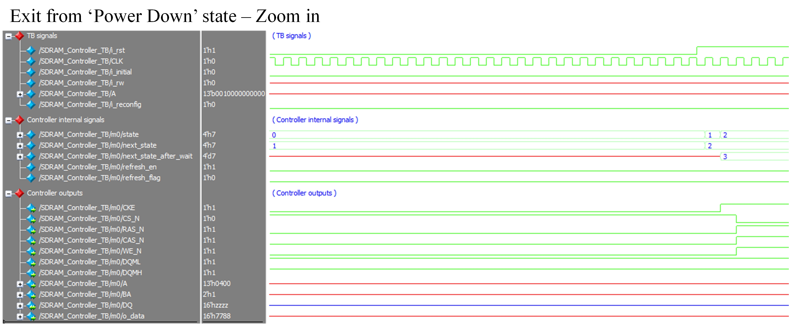
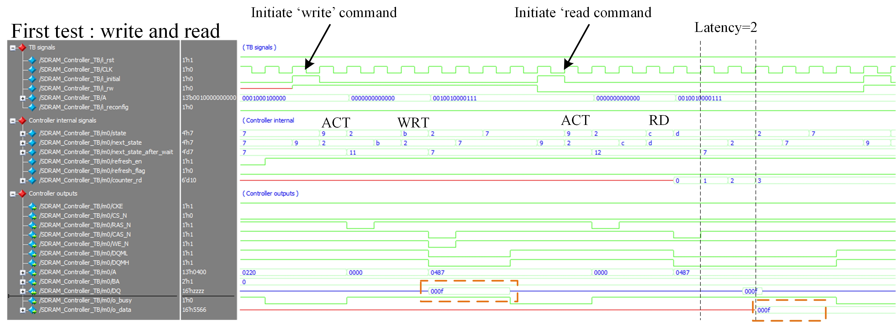
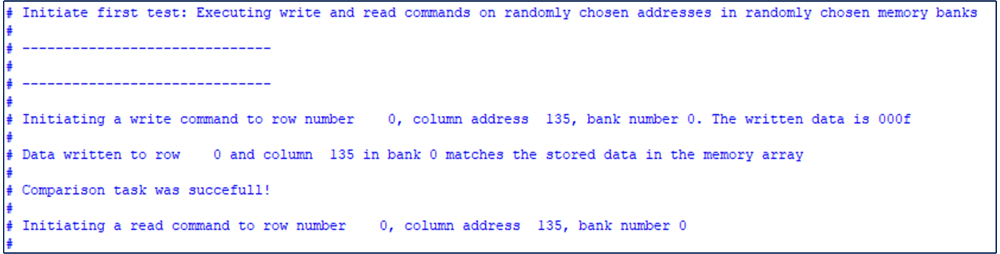

# SDRAM controller

> SystemVerilog SDRAM controller based on ISSI IS42S16320f-7

Implementention in SystemVerilog of __SDRAM Controller__.  

## Get Started

The source files  are located at the repository root:

- [SDRAM_Controller](./SDRAM_Controller.sv)
- [SDRAM_Controller_TB](./SDRAM_Controller_TB.sv)
- [QuestaSim simulation file](./wave.do)

Note: The simulation requires ISSI IS42S16320f-7 verilog model which I'm not uploading here due to legal issue. This file can be easialy obtained by emailing ISSI and asking for verilog model of the SDRAM IC. 

##
This repository containts a SystemVerilog implementation of SDRAM controller for [ISSI IS42S16320f-7 IC](https://www.issi.com/WW/pdf/42-45R-S_86400F-16320F.pdf)
The controller supports CBR (auto) refresh (self refresh mode was ommitted for simplicity but can easially be added) and executes read and write commands with auto pre-charge.

The following features are supported:
1.  Configurable latency (2 or 3 cycles)
2.  Configurable burst length (1,2,4,8)
3.  Single access write commands
4.  Mode register set from IDLE state

## Testbench

The testbench comprises three tests covering various read/write commands with of different latency values and burst lengths. 

**SDRAM TB:**
	  

1.	Executing 'write' command to a random address and memory bank, followed by a comparison task and a 'read' command. 
	
	**Waveform view:**
		  

	**CTerminal view:**
		  		
		
2.	Communication between controller '2' and target '2'. Write data from controller to target (2 data frames).
	Here the data sent from the controller to the peripheral unit is 16-bit long (2 data frames, 0011010111001111). 
	The target unit is 'target_2' (addr_1=7'b1001111) which is configured to execute byte-level clock streching.
	
	**Communication between controller '2' and target '2':**
		  

3.	Communication between controller '3' and an unkown target (address mismatch - terminated after the acknoledgement bit)
	Here the address of the target device (7'b1111110) does not match to any existing devices on the line. 
	
	**Communication between controller '3' and unkown target device:**
		  

4.	Communication between controller '1' and target '2'. Read data from target to controller (2 bytes are read)
	Note: Clock strectching is carried only when data is transferred from the controller to the target.
	
	**Communication between controller '1' and target '2':**
		  
		
5.	Communication between controller '1' and target '1'. Read data from target to controller (1 byte is read)
	Note: Clock strectching is carried only when data is transferred from the controller to the target.
	
	**Communication between controller '1' and target '1':**
		  

6.	Clock synchronization and arbitration verification
	The two controllers try to control the I2C lines. The timing specifiaction of the two are deliberately different to verify the clock synchronization logic (please see the I2C protocal manual for detailed explanation). Controller '1' is the 'winner' of the arbritration procedure (after the 4th address bit).
	
	**Clock synchronization and arbitration verification: controller '1' wins the arbritration proccess:**
		  

## FPGA - Altera DE2-115
Comming soon...
## Support

I will be happy to answer any questions.  
Approach me here using GitHub Issues or at tom.urkin@gmail.com