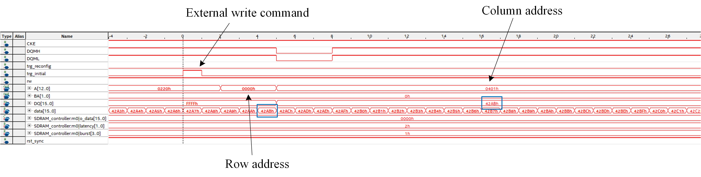
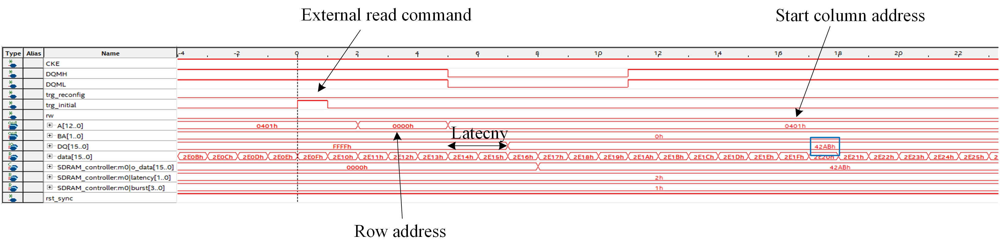

# SDRAM controller

> SDRAM controller implemented in SystemVerilog for ISSI IS42S16320f-7 IC 

Implementention in SystemVerilog of an __SDRAM Controller__ for ISSI IS42S16320f-7 IC. Verification is carried in simulation (QuestaSim) and on actual hardware on an ALTERA DE2-115 development board.

## Get Started

The source files  are located at the repository root:

- [SDRAM_Controller](./SDRAM_Controller.sv)
- [SDRAM_Controller_TB](./SDRAM_Controller_TB.sv)
- [QuestaSim simulation file](./wave.do)

Note: The simulation requires ISSI IS42S16320f-7 verilog model which I'm not uploading here due to legal issues. This file can be easialy obtained by emailing ISSI and asking for verilog model of the SDRAM IC. 

Note: The controller is mostly paramatrized and can be easialy modified to support other SDRAM ICs. Spcial care should be taken modifying the 'NOP' command durations in clock cycles which is a fucntion of the input clock freuqency.

##
This repository containts a SystemVerilog implementation of SDRAM controller for [ISSI IS42S16320f-7 IC](https://www.issi.com/WW/pdf/42-45R-S_86400F-16320F.pdf)
The controller supports CBR (auto) refresh (self refresh mode was ommitted for simplicity but can easially be added) and executes read and write commands with auto pre-charge.

The following features are supported:
1.  Configurable latency (2 or 3 cycles)
2.  Configurable burst length (1,2,4,8)
3.  Single access write commands
4.  Mode register set from IDLE state

## Testbench

The testbench comprises three tests covering various read/write scenarios with different latency values and burst lengths. 

**SDRAM TB:**
	  

**Exiting power-off mode:**
	  

**Initialization:**
	  

1.	Executing 'write' command to a random address and memory bank, followed by a comparison task and a 'read' command. 
	
	**Waveform view:**
		  

	**Terminal view:**
		 
		
2.	Changing the burst length to 2 and executing 'write' commands to consecutive addresses in the same bank followed by a read command.
	Note: please run the simulation and observe the terminal messages along with the corresponding waveforms (simulation results are not included here since the following test is very similar)

3.	Burst length and latency value are modified to 8 and 3, respectivly. Then, eight 'write' commands to consecutive addresses in the same bank are carried followed by a read command.	As can be seen, after the latency period, 8 consecutive words are latcehd which match the written data and the stored data in the memory array.

	**Waveform view:**
		  

	**Zoom-in view:**
		  

	**QuestaSim memory log:**
		  

## Hardware implementation 
The controller has been realized on Cyclone IV FPGA found in the DE2-115 development board. Pin locations for the controller's input, output and inout signals can be found in the user manual. Two external keys are used to initiate ACT and MODE_REGISTER_SET commands while various switches are used to set address and bank values. a free-running 16-bit counter is used to generate data to be written into the SDRAM (shown next).

Note: As discussed in the hardware section of the [I2C repository](https://github.com/tom-urkin/I2C), the 'inout' signals on the controller side (DQ) are seperated into 'DQ_rx' and 'DQ_tx' since tri-state buffers can only be instantiated in the 'top-level' of the design. 

**SDRAM initialization:**
	  
As can be seen, the address bus (0220h) indicates latency of 2, burst read of 1 and single-access write operation.

1.	Executing a 'write' command to row 0, column 1 in bank 0. Data to be written is 42ABh.
	
	**SignalTap view:**
		  

	Please refer to the marked instances of the 'data' bus and the 'DQ' bus to verify correct data has been written. 
	Note: data to be written is sampled upon ACT command initiation (please see SDRAM IC datasheet for further details).

2.	Executing a 'read' command to row 0, column 1 in bank 0.
	
	**SignalTap view:**
		  

	As can be seen, the read data is 42ABh as expected. 

3.	Reconfiguring the SDRAM IC (burst length=2)
	
	**SignalTap view:**
		  

4.	Executing a 'read' command to row 1, column 0 in bank 1.
	
	Prior to executing a 'read' command, two 'write' commands are made to following memory locations in row 1 of bank 1: B2E4h and CD1Bh.

	**SignalTap view:**
		  

	As can be seen, executing a 'read' command under the modified SDRAM IC settings results in burst read of two consecutive words which match the stored values. 

## Support

I will be happy to answer any questions.  
Approach me here using GitHub Issues or at tom.urkin@gmail.com