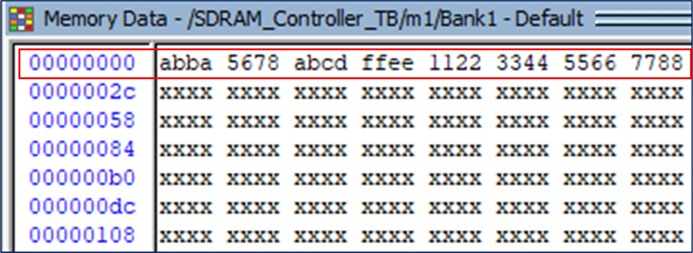

# SDRAM controller

> SDRAM controller implemented in SystemVerilog for ISSI IS42S16320f-7 IC 

Implementention in SystemVerilog of an __SDRAM Controller__

## Get Started

The source files  are located at the repository root:

- [SDRAM_Controller](./SDRAM_Controller.sv)
- [SDRAM_Controller_TB](./SDRAM_Controller_TB.sv)
- [QuestaSim simulation file](./wave.do)

Note: The simulation requires ISSI IS42S16320f-7 verilog model which I'm not uploading here due to legal issues. This file can be easialy obtained by emailing ISSI and asking for verilog model of the SDRAM IC. 

Note: The controller is mostly paramatrized and can be easialy modified to support other SDRAM ICs. Spcial care should be taken modifying the 'NOP' command durations in clock cycles which is a fucntion of the input clock freuqency.

##
This repository containts a SystemVerilog implementation of SDRAM controller for [ISSI IS42S16320f-7 IC](https://www.issi.com/WW/pdf/42-45R-S_86400F-16320F.pdf)
The controller supports CBR (auto) refresh (self refresh mode was ommitted for simplicity but can easially be added) and executes read and write commands with auto pre-charge.

The following features are supported:
1.  Configurable latency (2 or 3 cycles)
2.  Configurable burst length (1,2,4,8)
3.  Single access write commands
4.  Mode register set from IDLE state

## Testbench

The testbench comprises three tests covering various read/write scenarios with different latency values and burst lengths. 

**SDRAM TB:**
	  

**Exiting power-off mode:**
	  

**Initialization:**
	  

1.	Executing 'write' command to a random address and memory bank, followed by a comparison task and a 'read' command. 
	
	**Waveform view:**
		  

	**Terminal view:**
		 
		
2.	Changing the burst length to 2 and executing 'write' commands to consecutive addresses in the same bank followed by a read command.
	Note: please run the simulation and observe the terminal messages along with the corresponding waveforms (simulation results are not included here since the following test is very similar)

3.	Burst length and latency value are modified to 8 and 3, respectivly. Then, eight 'write' commands to consecutive addresses in the same bank are carried followed by a read command.	As can be seen, after the latency period, 8 consecutive words are latcehd which match the written data and the stored data in the memory array.

	**Waveform view:**
		  

	**Zoom-in view:**
		  

	**QuestaSim memory log:**
		  

## FPGA - Altera DE2-115
Comming soon...
## Support

I will be happy to answer any questions.  
Approach me here using GitHub Issues or at tom.urkin@gmail.com